# Inforange : site web de présentation de l'entreprise orange 

## Sujet  

 

[Accueil du site](https://aaigubel-iut90.github.io/ORANGE_SAE_S1.05.06_S1A1/) déposé sur Github

[Accueil du site](https://inforange-sa5-6.netlify.app/) déposé sur Gitlab

[Accueil du site](https://orange-sae-s10506-s1a1.netlify.app) déposé sur BitBucket
 

## Membres du groupe :
 

Etudiant 1 : (référent du groupe) :  [Natan Bouche](mailto:natan.bouchegin@edu.univ-fcomte.fr?subject=SAE_1_05_06)  

effectue la page offres 

pseudo github Natan90  

 

Etudiant 2 : [Aigubelle Arthur](mailto:aigubelle.arthur@edu.univ-fcomte.fr?subject=SAE_1_05_06)  

effectue la page histoire 

pseudo github aaigubel-iut90  

 

Etudiant 3 : [Noa Bigeard](mailto:noa.bigeard@edu.univ-fcomte.fr?subject=SAE_1_05_06)  

effectue la page social 

pseudo github NoaBigeard  

 

Etudiant 4 : [Ayoub Chakiri](mailto:ayoub.chakiri@edu.univ-fcomte.fr?subject=SAE_1_05_06)  

effectue la page écologie 

pseudo github Ayoubim68  

 

Etudiant 5 : [Emmanuel Levard](mailto:emmanuel.levard@edu.univ-fcomte.fr?subject=SAE_1_05_06)  

effectue la page économie 

pseudo github Emmaleva  

  

Le compte github "Imperial-py" dans les contributeurs est l'ancien compte de Emmanuel Levard, utilisé avant qu'une consigne soit émise a propos des noms des comptes github. Il est a ignorer  

# Présentation du projet 
 
Il s'agit d'un site web avec pour objectif de présenter l'entreprise Orange 
Il contient une page histoire, une page offres,une page économie, un page écologie et une page social. 
Il contiendra dans le futur un formulaire de contact ainsi que la possibilité de télécharger un rapport économique et/ou écologique sur l'entreprise Orange. 

## Validation des pages

### Page d'accueil

**Auteur : BOUCHE Natan/BIGEARD Noa**

Vérification W3C : 
 
[lien de la vérification](https://validator.w3.org/nu/?doc=https%3A%2F%2Faaigubel-iut90.github.io%2FORANGE_SAE_S1.05.06_S1A1%2Findex.html)
 

Screen de test d'éco-coneception :
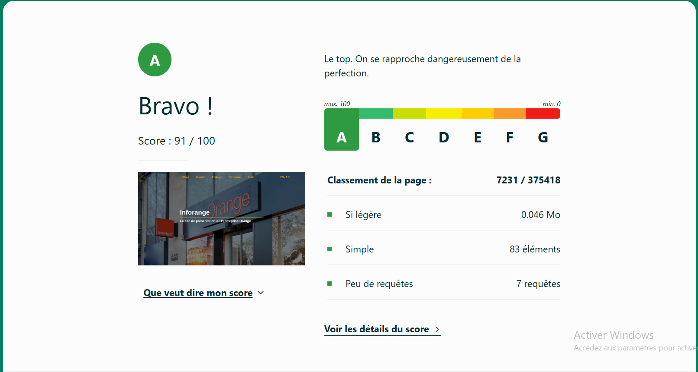

### Page Offres

**Auteur : BOUCHE Natan**

Vérifcation W3C :

 
[lien de la vérification](https://validator.w3.org/nu/?doc=https%3A%2F%2Faaigubel-iut90.github.io%2FORANGE_SAE_S1.05.06_S1A1%2Foffres%2Foffres.html)
 
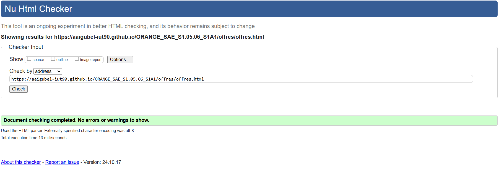

Screen de test d'éco-coneception :
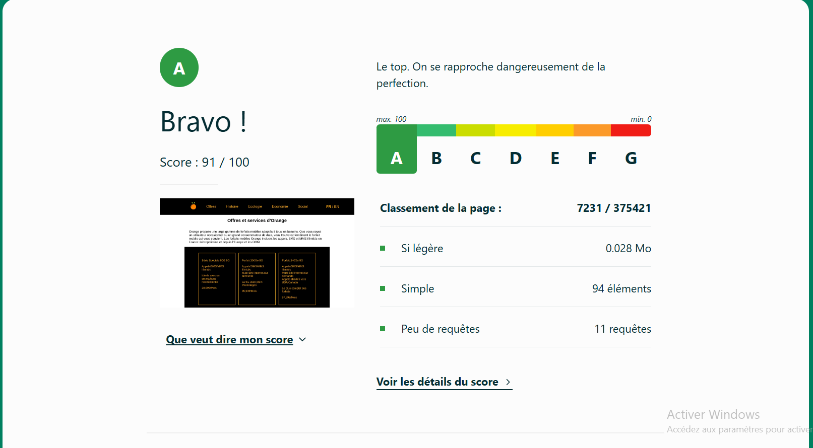

### Page Histoire

**Auteur : AIGUBELLE Arthur**

Vérification W3C :
 
[lien de la vérification](https://validator.w3.org/nu/?doc=https%3A%2F%2Faaigubel-iut90.github.io%2FORANGE_SAE_S1.05.06_S1A1%2Fhistoire%2Fhistoire.html)
 
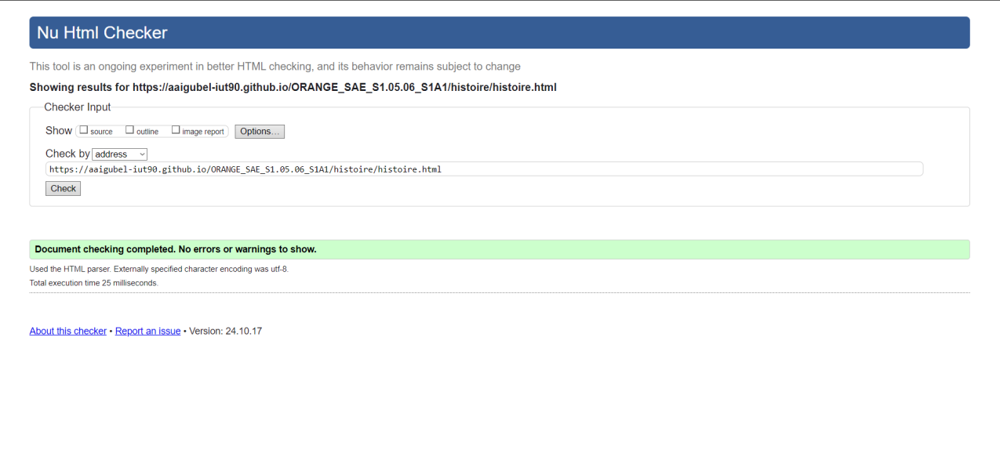

Screen de test d'éco-coneception :
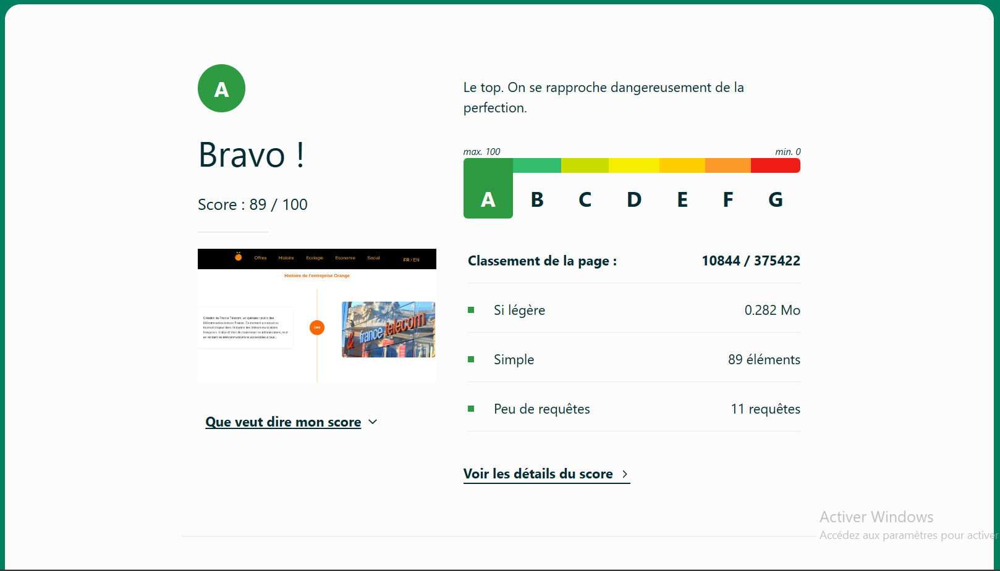

### Page Ecologie

**Auteur : CHAKIRI Ayoub**

Vérification W3C :
 
[lien de la vérification](https://validator.w3.org/nu/?doc=https%3A%2F%2Faaigubel-iut90.github.io%2FORANGE_SAE_S1.05.06_S1A1%2Fecologie%2Fecologie.html)
 

Screen de test d'éco-coneception :
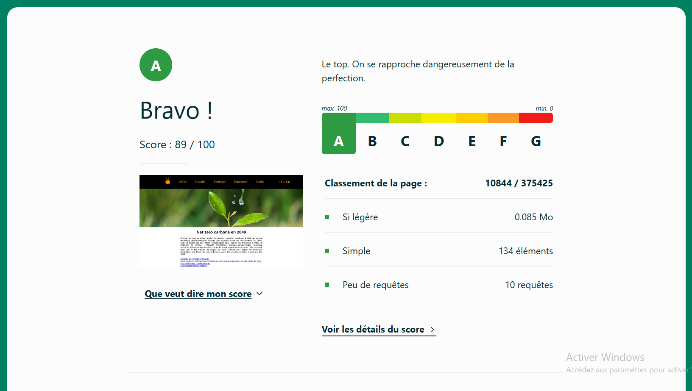

### Page Economie

**Auteur : LEVARD Emmanuel**

Vérification W3C :
 
[lien de la vérification](https://validator.w3.org/nu/?doc=https%3A%2F%2Faaigubel-iut90.github.io%2FORANGE_SAE_S1.05.06_S1A1%2Feconomie%2Feconomie.html)
 
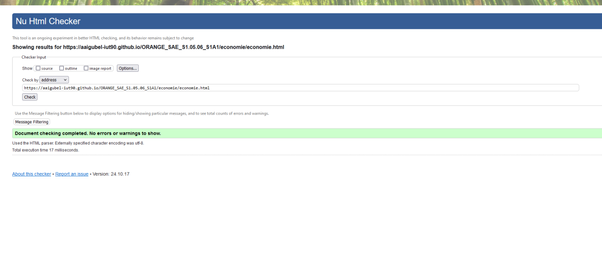

Screen de test d'éco-coneception :
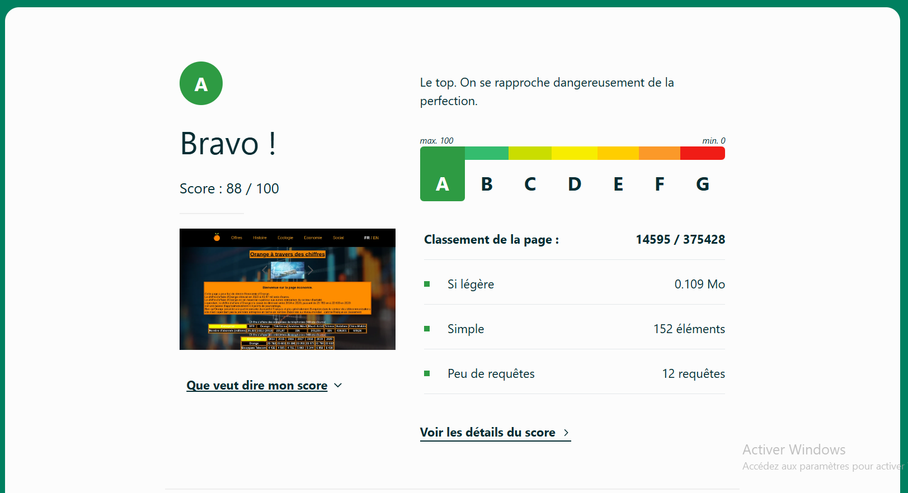

### Page Social

**Auteur : BIGEARD Noa**

Vérification W3C :
 
[lien de la vérification](https://validator.w3.org/nu/?doc=https%3A%2F%2Faaigubel-iut90.github.io%2FORANGE_SAE_S1.05.06_S1A1%2Fsocial%2Fsocial.html)
 
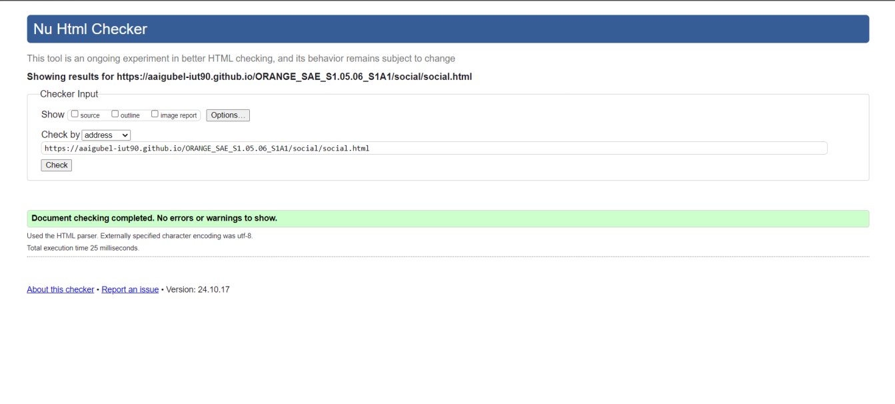

Screen de test d'éco-coneception :
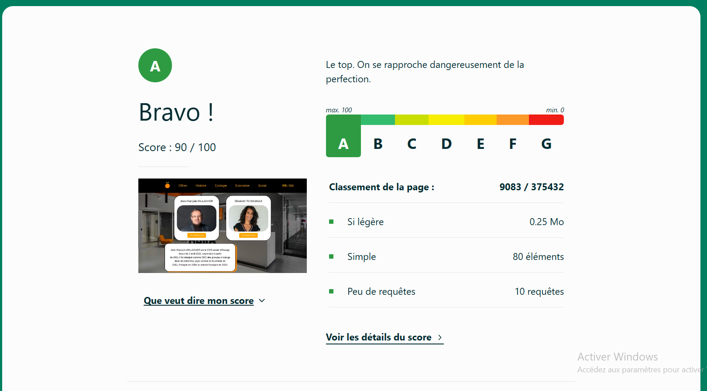

## Répartition du travail

### README
- Natan (80%)
- Arthur (20%)

### Planning - diagramme de GANTT
- Natan (100%)

### Questionnaire 1
- Natan (25%)
- Noa (25%)
- Arthur (15%)
- Emmanuel (20%)
- Ayoub (5%)

### Questionnaire 2
- Natan (35%)
- Noa (35%)
- Arthur (10%)
- Emmanuel (20%)

### Rapport Economique
- Natan (30%)
- Noa (30%)
- Arthur (15%)
- Emmanuel (15%)

### Traduction du site
- Noa (70%)
- Arthur (30%)

### Footer du site
- Natan (50%)
- Arthur (50%)

### Barre de navigation du site
- Natan (90%)
- Noa (10%)

### Page d'accueil
- Natan (70%)
- Noa (30%)

### Pages du site
- Offres : Natan (100%)
- Social : Noa (100%)
- Histoire : Arthur (100%)
- Economie : Emmanuel (100%)
- Ecologie : Ayoub (100%)

### Contributeurs

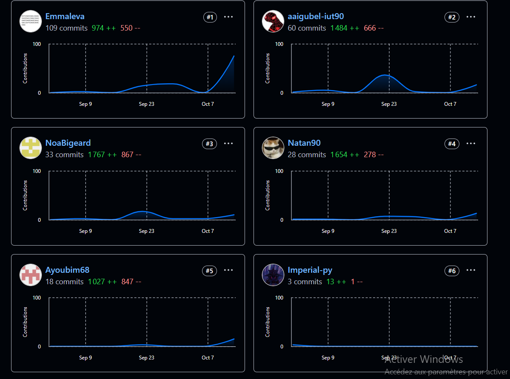
*Ignorer le compte imperial-py qui est un second compte de Emmanuel*

